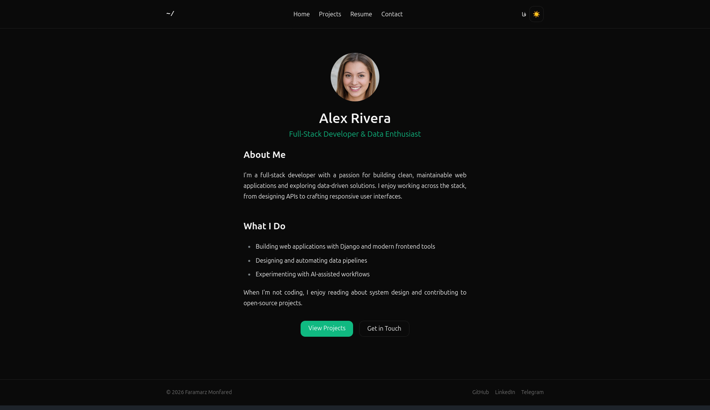

# Personal Portfolio Website

A bilingual (English/Persian) full-stack portfolio website built with Django,
featuring translated content, dark mode, markdown-powered project pages, and
a responsive design with RTL support.



## Features

- **Bilingual content** (English/Persian) with full RTL layout support via `django-parler`
- **Dark / light theme toggle** with persistent user preference
- **Markdown-powered content** for project details, experience, and education
- **Responsive design** across mobile, tablet, and desktop
- **Jalali (Persian) calendar** support for date fields in Persian mode
- **Cloudinary integration** for media storage (avatars, project images, resume files)
- **Contact form** with database-backed message storage
- **SEO-friendly** meta tags and Open Graph support

## Tech Stack

| Layer | Technology |
|---|---|
| Backend | Django |
| Templating | Jinja2 (via `django-jinja`) |
| Styling | Tailwind CSS v4 + DaisyUI |
| Database | PostgreSQL |
| Media Storage | Cloudinary |
| Translations | django-parler |
| Markdown | django-markdownx |
| Dependency Management | Poetry |
| Deployment | Docker, Fly.io |

## Project Structure

```
apps/
├── core/         # Profile, social links, homepage
├── portfolio/    # Projects, technologies, project images
├── resume/       # Experience, education, skills
└── contact/      # Contact form and message storage
config/
├── settings/     # base, development, production settings
├── jinja2.py     # Jinja2 environment configuration
└── urls.py
templates/
├── components/   # Reusable template partials (navbar, footer, theme toggle)
└── ...
theme/            # Tailwind CSS source and build output
```

## Getting Started

### Prerequisites

- Python 3.12+
- Poetry
- PostgreSQL
- Node.js (for Tailwind CSS build)

### Setup

1. Clone the repository:
   ```bash
   git clone https://github.com/faramarzmonfared/portfolio.git
   cd portfolio
   ```

2. Install dependencies:
   ```bash
   poetry install
   ```

3. Copy the environment template and fill in your values:
   ```bash
   cp .env.example .env
   ```

4. Run database migrations:
   ```bash
   poetry run python manage.py migrate
   ```

5. Install and start Tailwind CSS (in a separate terminal, kept running during development):
   ```bash
   poetry run python manage.py tailwind install
   poetry run python manage.py tailwind start
   ```

6. Run the development server:
   ```bash
   poetry run python manage.py runserver
   ```

7. Visit `http://127.0.0.1:8000/`

## Environment Variables

See `.env.example` for the full list of required environment variables,
including `SECRET_KEY`, `DATABASE_URL`, and `CLOUDINARY_URL`.

## Deployment

This project is configured for deployment via Docker on [Fly.io](https://fly.io),
using `gunicorn` and `whitenoise` for serving the application and static files
in production.

## License

This project is for personal and educational purposes.

## Author

**Faramarz Monfared**
Email: faramarzmonfared@gmail.com
